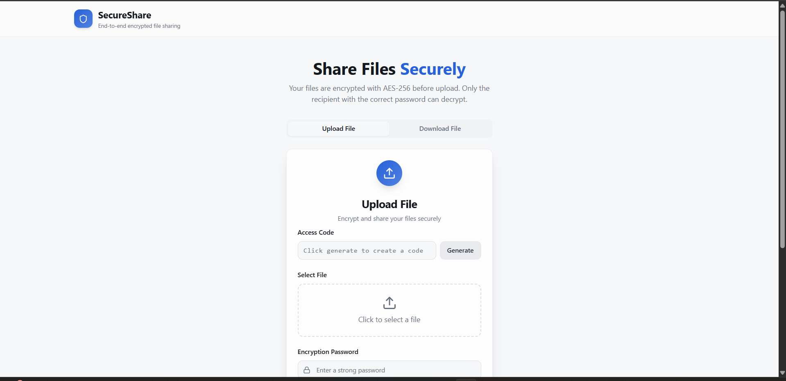
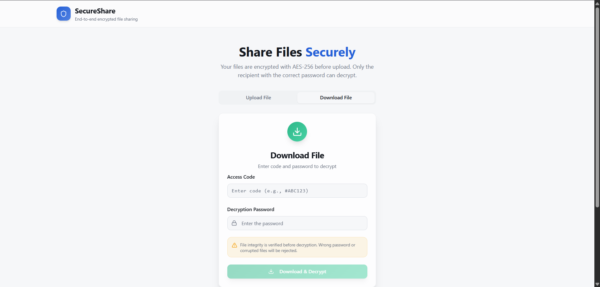

# SecureShare

> **End-to-end encrypted file sharing platform** with zero-knowledge architecture

SecureShare is a modern, secure file sharing application that allows users to upload and download files with military-grade encryption. All encryption happens client-side, ensuring complete privacy and security.

---

## 📸 Screenshots

### Upload Flow



### Download Flow



---

## ✨ Features

### 🔐 Security First

- **AES-256 Encryption** - Military-grade encryption for all files
- **Zero-Knowledge Architecture** - Passwords and encryption keys are never stored on our servers
- **Client-Side Encryption** - Files are encrypted in your browser before upload
- **HMAC Verification** - Guaranteed file integrity and authenticity
- **End-to-End Encryption** - Only the recipient with the correct password can decrypt

### 🚀 Core Functionality

- **Easy File Upload** - Drag & drop or click to select files
- **Secure Sharing** - Generate shareable links with password protection
- **Simple Download** - Enter password to decrypt and download files
- **Cross-Platform** - Works on any modern browser (desktop & mobile)

### 🎨 User Experience

- **Modern UI** - Clean, responsive interface built with Tailwind CSS
- **Intuitive Design** - Simple tab-based navigation
- **Real-time Feedback** - Progress indicators and status updates
- **Accessible** - Follows WCAG accessibility guidelines

---

## 🛠️ Technology Stack

### Frontend

- **React 18** - UI framework with hooks
- **Vite** - Lightning-fast build tool
- **Tailwind CSS** - Utility-first CSS framework
- **Shadcn/UI** - Re-accessible component library
- **React Query** - Server state management
- **React Router** - Client-side routing

### Backend & Storage

- **Supabase** - PostgreSQL database with realtime capabilities
- **Supabase Storage** - Secure file storage with bucket policies

### Development Tools

- **ESLint** - Code linting
- **Vitest** - Unit testing framework
- **PostCSS** - CSS processing
- **Lucide React** - Beautiful icon set

---

## 📦 Installation & Setup

### Prerequisites

- **Node.js** (v18 or higher)
- **npm** or **yarn** package manager
- **Git**

### Clone Repository

```bash
git clone https://github.com/yourusername/secure-share-box.git
cd secure-share-box
```

### Install Dependencies

```bash
npm install
```

### Environment Configuration

1. Copy the example environment file:

```bash
cp .env.example .env
```

2. Update the `.env` file with your Supabase credentials:

```env
VITE_SUPABASE_URL=your_supabase_project_url
VITE_SUPABASE_ANON_KEY=your_supabase_anon_key
```

**Note**: You'll need to create a Supabase project at [supabase.com](https://supabase.com) and set up:

- Storage bucket for file uploads
- Row Level Security (RLS) policies
- Database tables for metadata

### Run Development Server

```bash
npm run dev
```

The application will be available at `http://localhost:5173`

### Build for Production

```bash
npm run build
```

### Preview Production Build

```bash
npm run preview
```

---

## 🧪 Testing

### Run Tests

```bash
npm test
```

### Run Tests in Watch Mode

```bash
npm run test:watch
```

### Lint Code

```bash
npm run lint
```

---

## 📁 Project Structure

```
secure-share-box/
├── src/
│   ├── components/          # Reusable UI components
│   │   ├── ui/             # Shadcn/UI components
│   │   ├── FileUpload.jsx  # File upload component
│   │   └── FileDownload.jsx # File download component
│   ├── pages/              # Page components
│   │   ├── Index.jsx       # Home page
│   │   └── NotFound.jsx    # 404 page
│   ├── lib/                # Utility functions
│   ├── integrations/       # External service integrations
│   │   └── supabase/       # Supabase client configuration
│   ├── hooks/              # Custom React hooks
│   ├── App.jsx             # Main app component
│   ├── main.jsx            # App entry point
│   ├── index.css           # Global styles
│   └── App.css             # App-specific styles
├── public/                 # Static assets
├── supabase/              # Supabase configuration & migrations
├── .env.example           # Environment variables template
├── package.json           # Dependencies & scripts
├── vite.config.ts         # Vite configuration
├── tailwind.config.ts     # Tailwind CSS configuration
├── tsconfig.json          # TypeScript configuration
└── README.md              # This file
```

---

## 🔧 Configuration

### Vite Configuration

See `vite.config.ts` for build configuration, aliases, and plugin settings.

### Tailwind CSS

See `tailwind.config.ts` for theme customization, colors, and typography.

### Shadcn/UI Components

To add or modify UI components:

```bash
npx shadcn@latest add [component-name]
```

---

## 🔒 Security Notes

### Encryption Process

1. **File Selection** - User selects file in browser
2. **Password Input** - User enters encryption password
3. **Client-Side Encryption** - File encrypted using Web Crypto API with:
   - AES-256-GCM algorithm
   - Unique salt per file
   - Random initialization vector (IV)
4. **Upload** - Encrypted blob uploaded to Supabase Storage
5. **Metadata Storage** - File metadata (name, size, hash) stored in database

### Decryption Process

1. **Password Entry** - Recipient enters password
2. **Download** - Encrypted file downloaded from storage
3. **Client-Side Decryption** - File decrypted in browser
4. **Integrity Check** - HMAC verified before providing file

### Security Best Practices

- All encryption happens client-side
- Passwords are never transmitted to the server
- Each file uses a unique encryption key derived from the password
- HMAC ensures file integrity
- HTTPS required in production

---

## 🤝 Contributing

We welcome contributions! Please follow these guidelines:

### Getting Started

1. Fork the repository
2. Create a feature branch: `git checkout -b feature/amazing-feature`
3. Commit your changes: `git commit -m 'Add amazing feature'`
4. Push to the branch: `git push origin feature/amazing-feature`
5. Open a Pull Request

### Code Standards

- Follow existing code style and patterns
- Ensure all tests pass
- Add tests for new functionality
- Update documentation as needed

### Code of Conduct

Please be respectful and inclusive. Harassment or discrimination of any kind will not be tolerated.

---

## 📝 License

Distributed under the MIT License. See `LICENSE` file for more information.

---

## 🙏 Acknowledgments

- [Supabase](https://supabase.com) - Backend infrastructure
- [React](https://react.dev) - UI framework
- [Tailwind CSS](https://tailwindcss.com) - CSS framework
- [Shadcn/UI](https://ui.shadcn.com) - Component library
- [Vite](https://vitejs.dev) - Build tool
- All our amazing contributors

---

## 📞 Support

If you encounter any issues or have questions:

1. **Check the documentation** - We're working on comprehensive docs!
2. **Search existing issues** - Your question may already be answered
3. **Create an issue** - Include:
   - Browser and version
   - Steps to reproduce
   - Expected vs actual behavior
   - Screenshots if applicable
   - Console errors

---

## 🗺️ Roadmap

### Phase 1 (Current)

- [x] Basic file upload functionality
- [x] Secure file download
- [x] Client-side encryption
- [x] Responsive UI design

### Phase 2 (Planned)

- [ ] Email notifications
- [ ] File expiration dates
- [ ] Download limits
- [ ] Batch upload support
- [ ] Progress indicators
- [ ] Custom branding

### Phase 3 (Future)

- [ ] API for integrations
- [ ] Mobile app (React Native)
- [ ] Advanced sharing controls
- [ ] Audit logs
- [ ] Team features
- [ ] Admin dashboard

---

## 📊 Statistics

- **Framework**: React 18 + Javascript
- **Build Tool**: Vite 5
- **Styling**: Tailwind CSS 3.4
- **Backend**: Supabase
- **License**: MIT
- **Version**: 0.1.0

---

<details>
<summary>📖 Additional Documentation</summary>

- [Setup Guide](docs/setup.md) - Detailed installation instructions
- [Security Whitepaper](docs/security.md) - Technical deep dive on encryption
- [API Reference](docs/api.md) - API documentation (when available)
- [Deployment Guide](docs/deployment.md) - Production deployment instructions

</details>

---

**Made with ❤️ and lots of ☕ by me**
